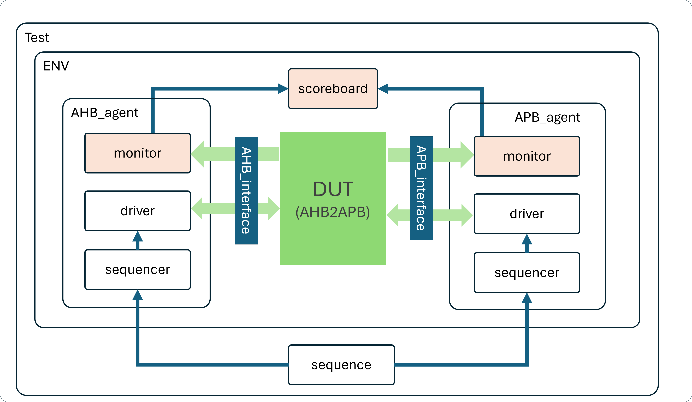

# UVM testbench for a APB slave memory

### Project : AHB-to-APB Bridge Verification
### Overview

DUT is AHB-to-APB Bridge which is AHB-lite Slave and APB Master. We will use 1 AHB Master and 1 APB Slaves. Need to verify whether the data sent by the AHB Master has reached the APB slave and vice versa

### Testbench Components
- Coverage Model (coverage.sv)
- Assertion (assertion.sv)

