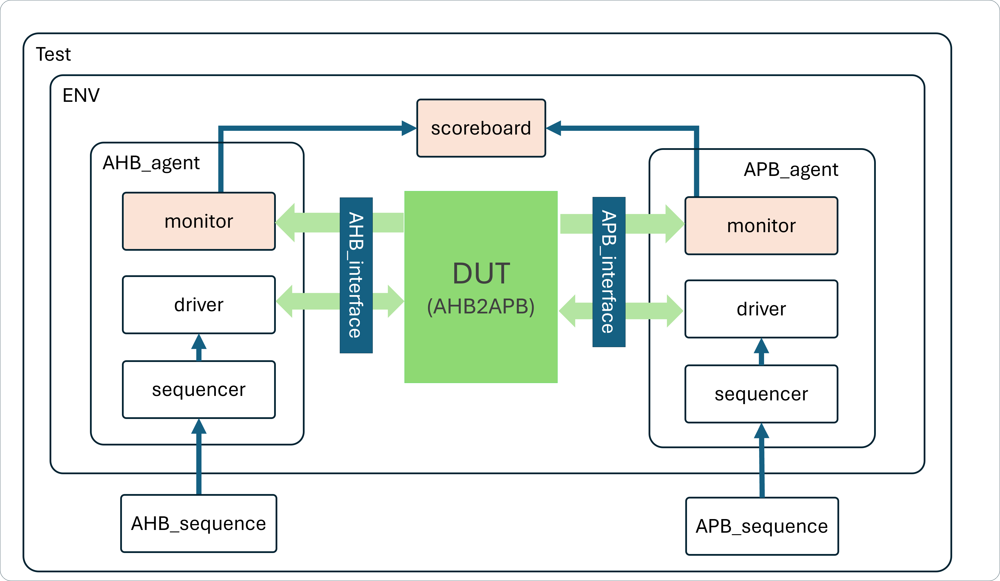
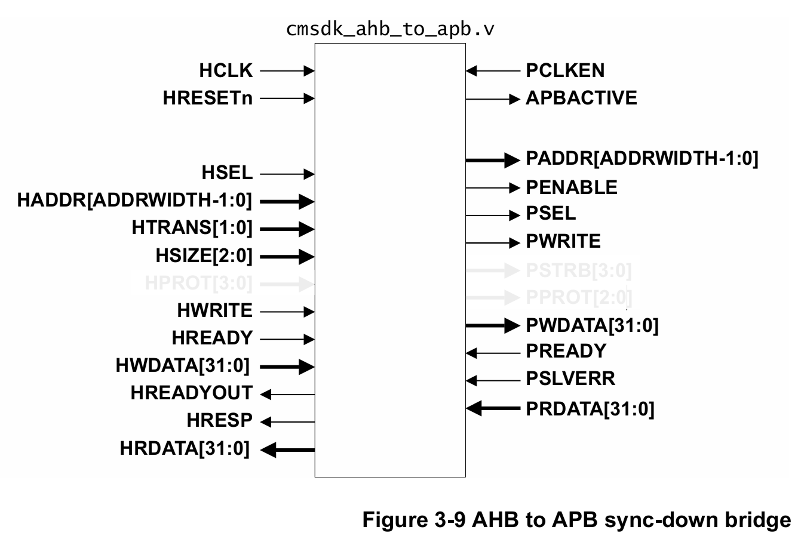

# UVM testbench for a AHB-to-APB Bridge

### Project : AHB-to-APB Bridge Verification
### Overview

A UVM testbench for AHB-to-APB Bridge, which is AHB-lite Slave and APB Master. We will use 1 AHB Master and 1 APB Slaves. Verify whether the data sent by the AHB Master has reached the APB slave and vice versa

- **🔗 Testcase plan**: [Caselist table](https://github.com/chenshowa/IC-Verification-Portfolio/blob/main/AHB-to-APB-Bridge-Verification/testcase_plan.xlsx)

### Testbench Components
- Assertion (`code/assertion.sv`)

.

### DUT

- The DUT is based on the SPEC provided by ARM. For detailed functional descriptions, please refer to the official [ARM documentation](https://developer.arm.com/documentation/ddi0479/d/basic-ahb-lite-components/ahb-to-apb-sync-down-bridge?lang=en).

- This project does not support APB4 functionality.

