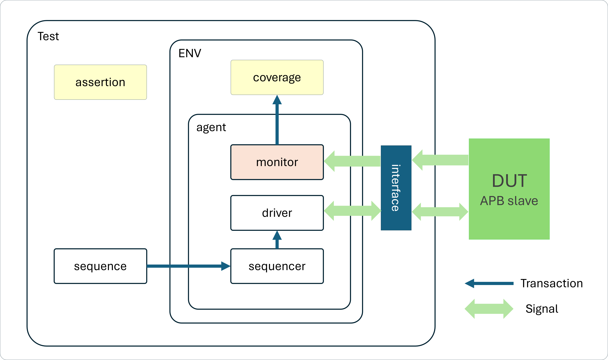
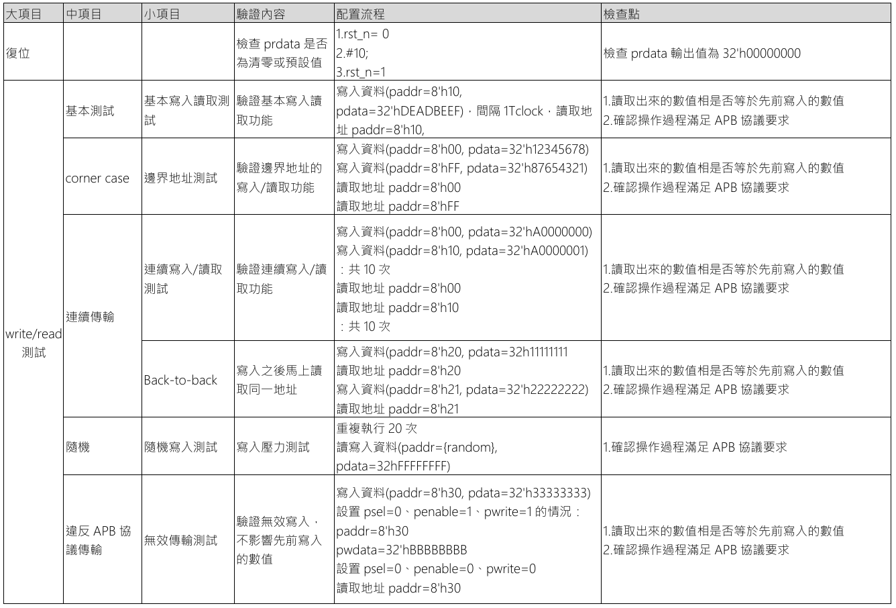

# UVM testbench for a APB slave memory

### Project : APB Slave Verification
### Overview
This DUT implements an APB3 slave device with built-in memory storage and configurable response delays for realistic bus timing simulation.

### Features

- **Memory Storage**: 256 x 32-bit internal memory array
APB3 Protocol 
- **Technologies**: SystemVerilog, UVM, APB3
- **Status**: ✅ Complete with runnable testbench
- **🔗 Live Demo**: [EDAPlayground - APB Slave](https://www.edaplayground.com/x/7_3E)
- **🔗 Testcase plan**: [Caselist table](https://github.com/chenshowa/IC-Verification-Portfolio/blob/main/APB-slave-Verification/testcase_plan.pdf)

### Testbench Components
- Test Sequence (`code/apb_test_sequence.sv`)
- Coverage Model (`code/apb_coverage.sv`)
- Assertion (`code/assertion.sv`)

.
### [Complete Testcase Plan](https://github.com/chenshowa/IC-Verification-Portfolio/blob/main/APB-slave-Verification/testcase_plan.pdf)

