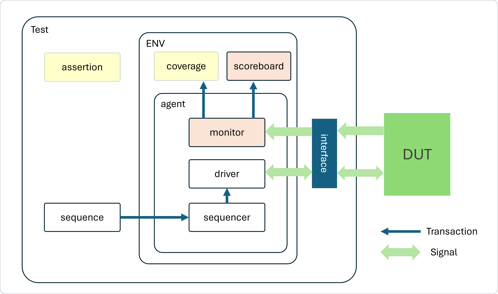

# UVM testbench for a 4-bit half adder
### Project : Half Adder Verification
### Overview
This project implements a comprehensive UVM testbench for verifying a 4-bit synchronous adder module. The testbench provides structured verification with functional coverage and directed test sequences.

- **Technologies**: SystemVerilog, UVM
- **Status**: ✅ Complete with runnable testbench
- **🔗 Live Demo**: [EDAPlayground - Half Adder](https://www.edaplayground.com/x/CP)

### Testbench Components
- Test Sequence (testcase.sv)
- Coverage Model (coverage.sv)
- Assertion (assertion.sv)

