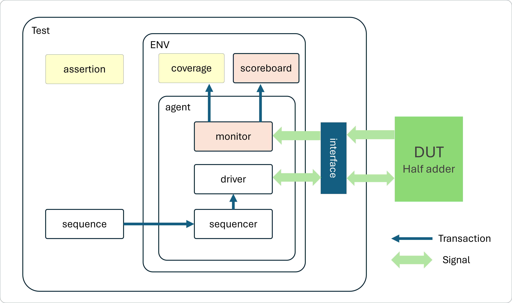

# UVM testbench for a 4-bit half adder
### Project : Half Adder Verification
### Overview
This project implements a UVM testbench for verifying a 4-bit synchronous adder module. 

- **Technologies**: SystemVerilog, UVM
- **Status**: ✅ Complete with runnable testbench
- **🔗 Live Demo**: [EDAPlayground - Half Adder](https://www.edaplayground.com/x/CPq6)
- **🔗 Testcase plan**: [Caselist table](https://github.com/chenshowa/IC-Verification-Portfolio/blob/main/Half-adder-Verification/testcase_plan.pdf)

### Testbench Components
- Test Sequence (`code/testcase.sv`)
- Coverage Model (`code/coverage.sv`)
- Assertion (`code/assertion.sv`)

